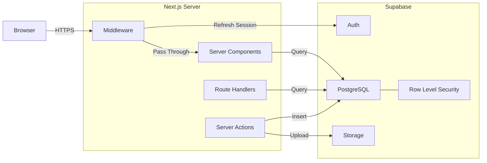
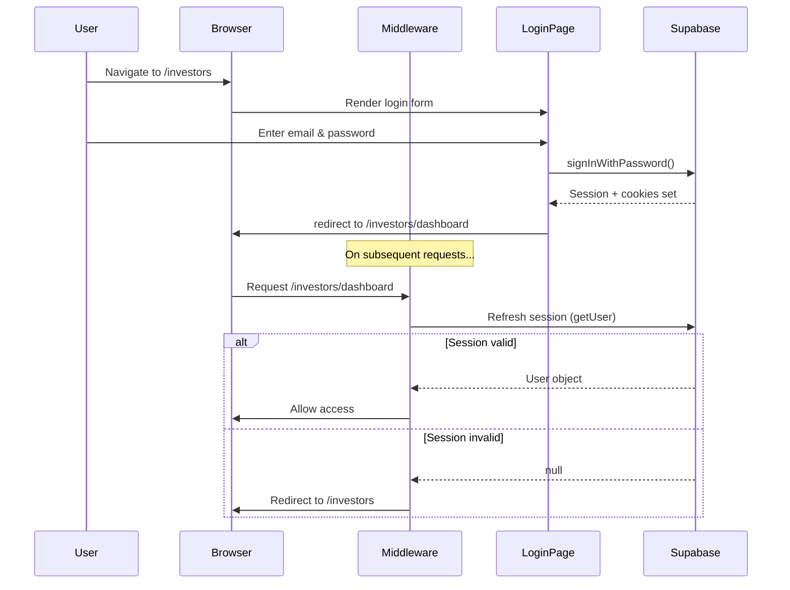

# Backend Architecture — GoodMatter

---

## Overview

GoodMatter uses a **serverless backend** powered by **Supabase** as a Backend-as-a-Service (BaaS). There is no custom backend server — all server-side logic runs through:

1. **Next.js Server Components** — Data fetching on the server
2. **Next.js Route Handlers** — API endpoints (`/api/*`)
3. **Next.js Server Actions** — Form submissions
4. **Next.js Middleware** — Auth session management & route protection
5. **Supabase** — Authentication, PostgreSQL database, storage, Row Level Security

---

## Architecture



---

## Authentication

### Strategy: Cookie-Based Sessions via `@supabase/ssr`

| Aspect | Detail |
|---|---|
| **Method** | Email + Password |
| **Token Storage** | HTTP-only cookies (not localStorage) |
| **Session Refresh** | Middleware refreshes on every request |
| **Validation** | `supabase.auth.getUser()` on server (never trust `getSession()` alone) |

### Auth Flow



### Supabase Client Configuration

#### Browser Client (`src/lib/supabase/client.ts`)
```typescript
import { createBrowserClient } from '@supabase/ssr'

export function createClient() {
  return createBrowserClient(
    process.env.NEXT_PUBLIC_SUPABASE_URL!,
    process.env.NEXT_PUBLIC_SUPABASE_ANON_KEY!
  )
}
```

#### Server Client (`src/lib/supabase/server.ts`)
```typescript
import { createServerClient } from '@supabase/ssr'
import { cookies } from 'next/headers'

export async function createClient() {
  const cookieStore = await cookies()
  return createServerClient(
    process.env.NEXT_PUBLIC_SUPABASE_URL!,
    process.env.NEXT_PUBLIC_SUPABASE_ANON_KEY!,
    {
      cookies: {
        getAll: () => cookieStore.getAll(),
        setAll: (cookiesToSet) => {
          cookiesToSet.forEach(({ name, value, options }) =>
            cookieStore.set(name, value, options)
          )
        },
      },
    }
  )
}
```

### Middleware (`src/middleware.ts`)

```typescript
// Protects /investors/dashboard/* routes
// Refreshes auth session on every request
export const config = {
  matcher: ['/investors/dashboard/:path*']
}
```

---

## Database Schema

### Table: `deals`

Stores curated startup deals shared with the investor community.

| Column | Type | Constraints | Description |
|---|---|---|---|
| `id` | `uuid` | PK, default `gen_random_uuid()` | Unique identifier |
| `startup_name` | `text` | NOT NULL | Company name |
| `sector` | `text` | NOT NULL | Industry vertical |
| `stage` | `text` | NOT NULL | Funding stage (Pre-Seed, Seed, Series A) |
| `raise_amount` | `text` | NOT NULL | Target raise (e.g., "$500K") |
| `summary` | `text` | NOT NULL | One-line pitch |
| `overview` | `text` | | Detailed company overview |
| `founders_info` | `text` | | Founder backgrounds |
| `product_info` | `text` | | Product/service description |
| `traction` | `text` | | Key metrics and traction data |
| `fundraising_details` | `text` | | Round structure, terms |
| `pitch_deck_url` | `text` | | Link to pitch deck in Supabase Storage |
| `financial_summary_url` | `text` | | Link to financial model |
| `logo_url` | `text` | | Company logo URL |
| `is_featured` | `boolean` | DEFAULT false | Show on public homepage |
| `created_at` | `timestamptz` | DEFAULT now() | Record creation time |

**RLS Policy:**
```sql
-- Only authenticated users can view deals
CREATE POLICY "Authenticated users can view deals"
  ON deals FOR SELECT
  USING (auth.role() = 'authenticated');
```

---

### Table: `contacts`

Stores contact form submissions from the public website.

| Column | Type | Constraints | Description |
|---|---|---|---|
| `id` | `uuid` | PK, default `gen_random_uuid()` | Unique identifier |
| `name` | `text` | NOT NULL | Submitter's name |
| `email` | `text` | NOT NULL | Submitter's email |
| `phone` | `text` | | Phone number |
| `inquiry_type` | `text` | NOT NULL | Type of inquiry |
| `message` | `text` | NOT NULL | Message body |
| `created_at` | `timestamptz` | DEFAULT now() | Submission time |

**RLS Policy:**
```sql
-- Anyone can submit a contact form
CREATE POLICY "Anyone can insert contacts"
  ON contacts FOR INSERT
  WITH CHECK (true);

-- Only service role can read contacts (admin via Supabase dashboard)
-- No SELECT policy for anon/authenticated = denied by default
```

---

### Table: `founder_applications`

Stores startup applications submitted by founders.

| Column | Type | Constraints | Description |
|---|---|---|---|
| `id` | `uuid` | PK, default `gen_random_uuid()` | Unique identifier |
| `startup_name` | `text` | NOT NULL | Company name |
| `founder_name` | `text` | NOT NULL | Primary founder |
| `email` | `text` | NOT NULL | Contact email |
| `description` | `text` | NOT NULL | Startup description |
| `sector` | `text` | | Industry vertical |
| `stage` | `text` | | Current funding stage |
| `raise_amount` | `text` | | Target raise |
| `pitch_deck_url` | `text` | | Uploaded pitch deck |
| `status` | `text` | DEFAULT 'pending' | pending / under_review / accepted / declined |
| `created_at` | `timestamptz` | DEFAULT now() | Application time |

**RLS Policy:**
```sql
-- Anyone can submit an application
CREATE POLICY "Anyone can apply"
  ON founder_applications FOR INSERT
  WITH CHECK (true);
```

---

### Table: `introduction_requests`

Tracks investor requests to be introduced to founders.

| Column | Type | Constraints | Description |
|---|---|---|---|
| `id` | `uuid` | PK, default `gen_random_uuid()` | Unique identifier |
| `deal_id` | `uuid` | FK → deals.id, NOT NULL | Related deal |
| `investor_id` | `uuid` | FK → auth.users.id, NOT NULL | Requesting investor |
| `message` | `text` | | Optional note from investor |
| `status` | `text` | DEFAULT 'pending' | pending / introduced / declined |
| `created_at` | `timestamptz` | DEFAULT now() | Request time |

**RLS Policy:**
```sql
-- Authenticated users can request introductions
CREATE POLICY "Authenticated users can request introductions"
  ON introduction_requests FOR INSERT
  WITH CHECK (auth.uid() = investor_id);

-- Users can view their own requests
CREATE POLICY "Users can view own requests"
  ON introduction_requests FOR SELECT
  USING (auth.uid() = investor_id);
```

---

## API Endpoints

### Server Actions (Form Submissions)

| Action | File | Description |
|---|---|---|
| `submitContactForm` | `src/app/contact/actions.ts` | Inserts into `contacts` table |
| `submitFounderApplication` | `src/app/founders/actions.ts` | Inserts into `founder_applications` table |
| `requestIntroduction` | `src/app/investors/dashboard/[id]/actions.ts` | Inserts into `introduction_requests` table |

### Route Handlers (API Routes)

| Endpoint | Method | Auth | Description |
|---|---|---|---|
| `/api/auth/callback` | GET | — | Supabase OAuth callback handler |
| `/api/auth/signout` | POST | Authenticated | Signs out user, clears cookies |

---

## Data Flow Examples

### Contact Form Submission
```
User fills form → Client Component calls Server Action →
Server Action creates Supabase server client →
Insert into contacts table → Return success/error →
Client shows toast notification
```

### Investor Views Deals
```
Investor navigates to /investors/dashboard →
Middleware checks auth (refreshes session) →
Server Component creates Supabase server client →
SELECT * FROM deals (RLS ensures user is authenticated) →
Render deal cards
```

### Investor Requests Introduction
```
Investor clicks "Request Introduction" on deal detail page →
Server Action creates Supabase server client →
Get current user via getUser() →
Insert into introduction_requests with deal_id + investor_id →
Return confirmation
```

---

## Storage (Supabase Storage)

### Buckets

| Bucket | Access | Purpose |
|---|---|---|
| `pitch-decks` | Private (authenticated only) | Startup pitch deck PDFs |
| `financials` | Private (authenticated only) | Financial summaries |
| `logos` | Public | Startup and partner logos |

### Storage Policies
```sql
-- Public read access for logos
CREATE POLICY "Public logo access"
  ON storage.objects FOR SELECT
  USING (bucket_id = 'logos');

-- Authenticated users can download pitch decks
CREATE POLICY "Authenticated pitch deck access"
  ON storage.objects FOR SELECT
  USING (bucket_id = 'pitch-decks' AND auth.role() = 'authenticated');
```

---

## Security Summary

| Layer | Mechanism |
|---|---|
| **Transport** | HTTPS enforced by hosting platform |
| **Authentication** | Supabase Auth; HTTP-only cookies; server-side validation |
| **Authorization** | Row Level Security on all tables |
| **Input Validation** | Server Actions validate input before database operations |
| **Environment** | Secrets stored in env vars; service role key never exposed to client |
| **Headers** | Security headers via `next.config.js` (CSP, HSTS, X-Frame-Options) |
| **Rate Limiting** | Supabase built-in rate limits; consider edge rate limiting for forms |

---

## Error Handling Strategy

| Scenario | Handling |
|---|---|
| Auth failure (login) | Display inline error message on form |
| Auth session expired | Middleware redirects to login with `?expired=true` query param |
| Database query error | Server Component renders error boundary with retry option |
| Form submission error | Server Action returns `{ error: string }` → client shows toast |
| 404 (deal not found) | Next.js `notFound()` → custom 404 page |
| Network error | Client-side error boundary with "try again" prompt |
