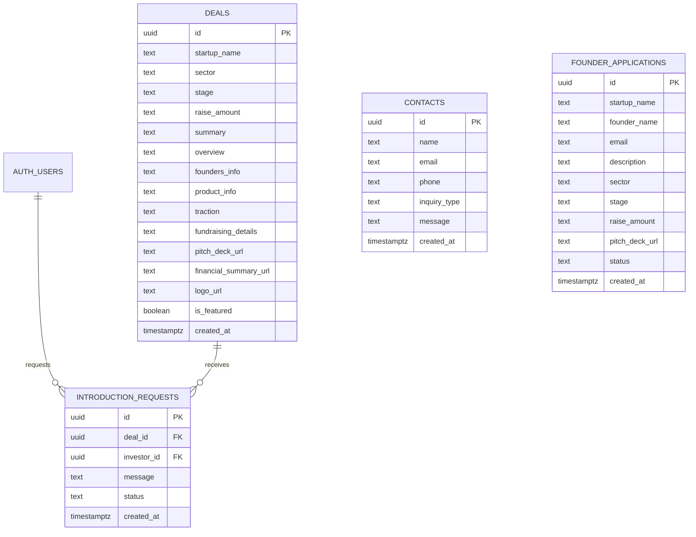

# Database Schema & Migrations — GoodMatter

---

## Setup Instructions

### Option A: Supabase Dashboard (Recommended for v1)
1. Go to your Supabase project → **SQL Editor**
2. Paste the migration SQL below and execute

### Option B: Supabase CLI
```bash
supabase init
supabase migration new initial_schema
# Paste SQL into the generated migration file
supabase db push
```

---

## Migration SQL

```sql
-- ============================================================
-- GoodMatter Database Schema
-- Version: 1.0
-- ============================================================

-- Enable UUID generation
CREATE EXTENSION IF NOT EXISTS "uuid-ossp";

-- ============================================================
-- TABLE: deals
-- Stores curated startup deals shared with investors
-- ============================================================
CREATE TABLE deals (
  id              UUID PRIMARY KEY DEFAULT gen_random_uuid(),
  startup_name    TEXT NOT NULL,
  sector          TEXT NOT NULL,
  stage           TEXT NOT NULL,
  raise_amount    TEXT NOT NULL,
  summary         TEXT NOT NULL,
  overview        TEXT,
  founders_info   TEXT,
  product_info    TEXT,
  traction        TEXT,
  fundraising_details TEXT,
  pitch_deck_url  TEXT,
  financial_summary_url TEXT,
  logo_url        TEXT,
  is_featured     BOOLEAN DEFAULT FALSE,
  created_at      TIMESTAMPTZ DEFAULT NOW()
);

-- RLS: Only authenticated users can view deals
ALTER TABLE deals ENABLE ROW LEVEL SECURITY;

CREATE POLICY "Authenticated users can view deals"
  ON deals FOR SELECT
  USING (auth.role() = 'authenticated');

-- Featured deals visible to everyone (for homepage)
CREATE POLICY "Public can view featured deals"
  ON deals FOR SELECT
  USING (is_featured = TRUE);

-- ============================================================
-- TABLE: contacts
-- Stores contact form submissions
-- ============================================================
CREATE TABLE contacts (
  id            UUID PRIMARY KEY DEFAULT gen_random_uuid(),
  name          TEXT NOT NULL,
  email         TEXT NOT NULL,
  phone         TEXT,
  inquiry_type  TEXT NOT NULL CHECK (inquiry_type IN (
    'investor_inquiry',
    'founder_application',
    'impact_studio',
    'partnership',
    'general'
  )),
  message       TEXT NOT NULL,
  created_at    TIMESTAMPTZ DEFAULT NOW()
);

-- RLS: Anyone can insert (public form), no public read
ALTER TABLE contacts ENABLE ROW LEVEL SECURITY;

CREATE POLICY "Anyone can submit contact form"
  ON contacts FOR INSERT
  WITH CHECK (TRUE);

-- ============================================================
-- TABLE: founder_applications
-- Stores startup applications from founders
-- ============================================================
CREATE TABLE founder_applications (
  id              UUID PRIMARY KEY DEFAULT gen_random_uuid(),
  startup_name    TEXT NOT NULL,
  founder_name    TEXT NOT NULL,
  email           TEXT NOT NULL,
  description     TEXT NOT NULL,
  sector          TEXT,
  stage           TEXT,
  raise_amount    TEXT,
  pitch_deck_url  TEXT,
  status          TEXT DEFAULT 'pending' CHECK (status IN (
    'pending',
    'under_review',
    'accepted',
    'declined'
  )),
  created_at      TIMESTAMPTZ DEFAULT NOW()
);

-- RLS: Anyone can apply, no public read
ALTER TABLE founder_applications ENABLE ROW LEVEL SECURITY;

CREATE POLICY "Anyone can submit application"
  ON founder_applications FOR INSERT
  WITH CHECK (TRUE);

-- ============================================================
-- TABLE: introduction_requests
-- Tracks investor requests to meet founders
-- ============================================================
CREATE TABLE introduction_requests (
  id            UUID PRIMARY KEY DEFAULT gen_random_uuid(),
  deal_id       UUID NOT NULL REFERENCES deals(id) ON DELETE CASCADE,
  investor_id   UUID NOT NULL REFERENCES auth.users(id) ON DELETE CASCADE,
  message       TEXT,
  status        TEXT DEFAULT 'pending' CHECK (status IN (
    'pending',
    'introduced',
    'declined'
  )),
  created_at    TIMESTAMPTZ DEFAULT NOW(),
  
  -- Prevent duplicate requests
  UNIQUE(deal_id, investor_id)
);

-- RLS: Users can create and view their own requests
ALTER TABLE introduction_requests ENABLE ROW LEVEL SECURITY;

CREATE POLICY "Authenticated users can request introductions"
  ON introduction_requests FOR INSERT
  WITH CHECK (auth.uid() = investor_id);

CREATE POLICY "Users can view own introduction requests"
  ON introduction_requests FOR SELECT
  USING (auth.uid() = investor_id);

-- ============================================================
-- INDEXES for performance
-- ============================================================
CREATE INDEX idx_deals_created_at ON deals(created_at DESC);
CREATE INDEX idx_deals_is_featured ON deals(is_featured) WHERE is_featured = TRUE;
CREATE INDEX idx_deals_sector ON deals(sector);
CREATE INDEX idx_contacts_created_at ON contacts(created_at DESC);
CREATE INDEX idx_founder_applications_status ON founder_applications(status);
CREATE INDEX idx_founder_applications_email ON founder_applications(email);
CREATE INDEX idx_introduction_requests_deal ON introduction_requests(deal_id);
CREATE INDEX idx_introduction_requests_investor ON introduction_requests(investor_id);

-- ============================================================
-- STORAGE BUCKETS (run in Supabase dashboard)
-- ============================================================
-- These must be created via the Supabase dashboard or API:
--
-- 1. Bucket: "logos" (public)
-- 2. Bucket: "pitch-decks" (private, authenticated read)
-- 3. Bucket: "financials" (private, authenticated read)
```

---

## Seed Data (for development)

```sql
-- Sample deals for testing
INSERT INTO deals (startup_name, sector, stage, raise_amount, summary, overview, founders_info, product_info, traction, fundraising_details, is_featured) VALUES
(
  'NovaPay',
  'Fintech',
  'Seed',
  '₹2 Cr',
  'UPI-first payment infrastructure for D2C brands',
  'NovaPay builds payment infrastructure specifically designed for D2C brands, enabling instant settlements, smart routing, and embedded financial tools.',
  'Aditya Sharma (ex-PhonePe) & Meera Patel (ex-Razorpay)',
  'Payment gateway with smart routing, instant settlements, and merchant analytics dashboard.',
  '₹50L MRR, 200+ merchants, 40% MoM growth',
  'Raising ₹2 Cr at ₹10 Cr pre-money valuation. Lead investor committed for ₹75L.',
  TRUE
),
(
  'GreenStack',
  'Climate Tech',
  'Pre-Seed',
  '₹1 Cr',
  'Carbon credit marketplace for SMEs',
  'GreenStack makes carbon credit purchasing accessible to small and medium enterprises through an automated marketplace.',
  'Ravi Kumar (ex-Zerodha) & Ananya Desai (climate scientist, IISc)',
  'Marketplace matching verified carbon credit sellers with SME buyers. Automated compliance reporting.',
  'LOIs from 50 SMEs, pilot with 10 companies, partnerships with 3 verification bodies',
  'Raising ₹1 Cr at ₹5 Cr pre-money. Looking for climate-focused angels.',
  TRUE
),
(
  'LearnLoop',
  'EdTech',
  'Series A',
  '₹10 Cr',
  'AI-powered adaptive learning for K-12 students',
  'LearnLoop uses AI to personalize learning paths for K-12 students, adapting difficulty and content based on individual progress.',
  'Dr. Sunita Verma (20yr education experience) & Karthik Nair (ex-Google AI)',
  'Mobile app with adaptive learning engine, parent dashboard, and school management integration.',
  '₹2 Cr ARR, 50K active students, 200 partner schools, 85% retention rate',
  'Raising ₹10 Cr Series A. Existing investors: Blume Ventures, AngelList India.',
  TRUE
),
(
  'MedBridge',
  'HealthTech',
  'Seed',
  '₹3 Cr',
  'Telemedicine platform connecting rural clinics to specialist doctors',
  'MedBridge enables rural healthcare centers to connect with urban specialists via video consultations and AI-assisted diagnostics.',
  'Dr. Pradeep Joshi (AIIMS alumni) & Neha Singh (ex-Practo)',
  'Video consultation platform with AI pre-screening, electronic health records, and pharmacy integration.',
  'Live in 5 states, 100 rural clinics, 10K consultations/month, partnerships with 3 state governments',
  'Raising ₹3 Cr at ₹15 Cr valuation. Impact-focused investors preferred.',
  FALSE
),
(
  'UrbanBox',
  'Logistics',
  'Pre-Seed',
  '₹75L',
  'Dark store network for same-day B2B deliveries',
  'UrbanBox operates micro-warehouses in tier-2 cities enabling same-day B2B deliveries for local retailers.',
  'Amit Choudhary (ex-Delhivery) & Pooja Reddy (supply chain consultant)',
  'Dark store management system with route optimization, inventory sync, and retailer app.',
  'Pilot in 2 cities, 30 retailers onboarded, 500 deliveries/day, unit economics positive',
  'Raising ₹75L angel round. Looking for logistics and retail-focused investors.',
  FALSE
);

-- Sample contact inquiry
INSERT INTO contacts (name, email, phone, inquiry_type, message) VALUES
('Test User', 'test@example.com', '+91 98765 43210', 'general', 'I am interested in learning more about GoodMatter.');
```

---

## Entity Relationship Diagram


