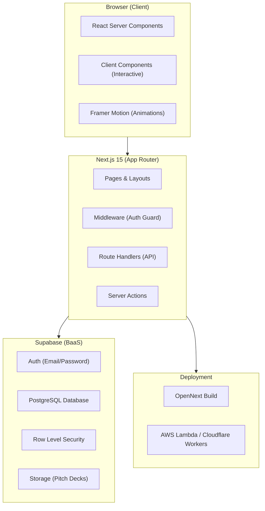
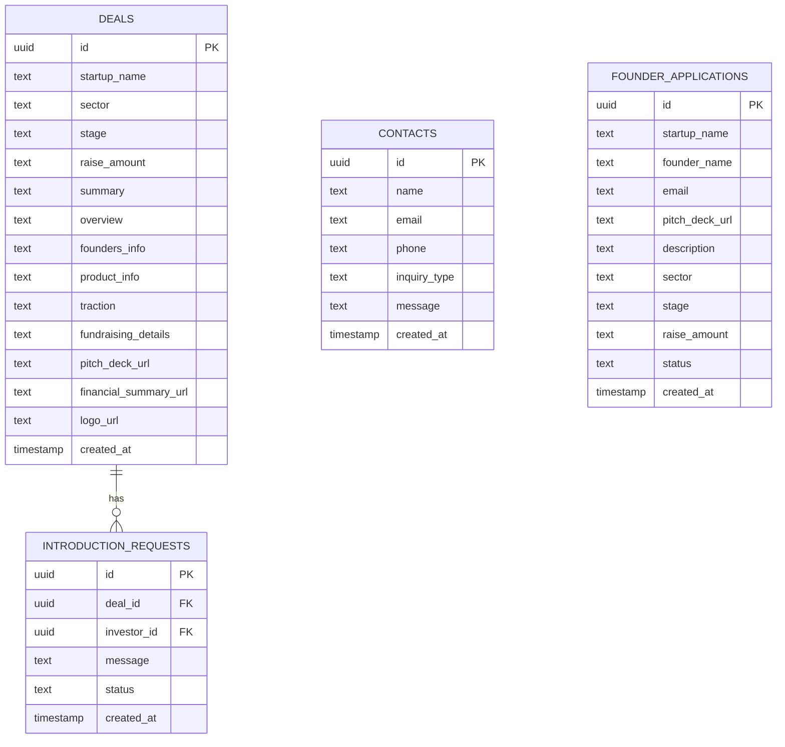

# Tech Stack — GoodMatter

---

## Architecture Overview



---

## Core Stack

| Layer | Technology | Version | Purpose |
|---|---|---|---|
| **Framework** | Next.js | 15.x | React framework with App Router, RSC, streaming |
| **Language** | TypeScript | 5.x | Type safety across the entire codebase |
| **Runtime** | Node.js | 20.x LTS | Server-side runtime |
| **Package Manager** | npm | 10.x | Dependency management |

---

## Frontend

| Technology | Purpose | Rationale |
|---|---|---|
| **React 19** | UI library | Server Components, Suspense, streaming |
| **CSS Modules + Global CSS** | Styling | No framework bloat; full control over Jony Ive design system |
| **Framer Motion** | Animations | Declarative, performant micro-animations |
| **Lucide React** | Icons | Lightweight, consistent line icons (Ive-style aesthetic) |
| **Inter (Google Fonts)** | Typography | Clean, geometric sans-serif; tight letter-spacing |

### Why NOT Tailwind?
The Jony Ive design philosophy demands precise control over spacing, typography, and color that benefits from a hand-crafted CSS design system with custom properties. Utility-first frameworks add visual noise to JSX and make the reductive design intent harder to read in code.

---

## Backend / BaaS

| Technology | Purpose | Rationale |
|---|---|---|
| **Supabase** | Auth + Database + Storage | Full-stack BaaS; instant PostgreSQL; built-in auth |
| **@supabase/ssr** | Server-side auth in Next.js | Cookie-based sessions; works with RSC and middleware |
| **@supabase/supabase-js** | Client SDK | Type-safe database queries; real-time subscriptions (future) |
| **PostgreSQL** | Database | Relational data model for deals, contacts, applications |
| **Row Level Security** | Authorization | Database-level access control; zero-trust by default |

### Supabase Client Architecture
```
src/lib/supabase/
├── client.ts    → createBrowserClient()   — used in Client Components
└── server.ts    → createServerClient()    — used in Server Components, Route Handlers, Server Actions
```

**Middleware** (`src/middleware.ts`):
- Refreshes auth session on every request
- Protects `/investors/dashboard/*` routes
- Redirects unauthenticated users to `/investors` login page

---

## Deployment

| Technology | Purpose | Rationale |
|---|---|---|
| **OpenNext** | Build adapter | Makes Next.js deployable outside Vercel |
| **Target TBD** | Hosting | AWS Lambda (via SST) or Cloudflare Workers |

### OpenNext Build Pipeline
```
next build → open-next build → Deploy to serverless platform
```

OpenNext transforms the Next.js build output into a format compatible with serverless runtimes, handling:
- Server functions (SSR, API routes, middleware)
- Static assets (CDN-served)
- Image optimization
- ISR/revalidation

---

## Database Schema



---

## Development Tools

| Tool | Purpose |
|---|---|
| ESLint | Code quality + Next.js rules |
| TypeScript strict mode | Type safety at compile time |
| Git | Version control |
| VS Code | Recommended IDE |
| Supabase CLI (optional) | Local development, migrations |

---

## Environment Variables

```env
# Supabase
NEXT_PUBLIC_SUPABASE_URL=         # Supabase project URL (public)
NEXT_PUBLIC_SUPABASE_ANON_KEY=    # Supabase anon/public key (public)
SUPABASE_SERVICE_ROLE_KEY=        # Supabase service role key (server-only, NEVER expose)

# App
NEXT_PUBLIC_SITE_URL=             # Production URL for SEO/OG tags
```

---

## Performance Targets

| Metric | Target | Strategy |
|---|---|---|
| LCP | < 2.5s | Server Components; optimized images; font preloading |
| FID | < 100ms | Minimal client JS; code splitting |
| CLS | < 0.1 | Fixed layout dimensions; font-display: swap |
| Bundle Size | < 150KB (first load JS) | Tree shaking; dynamic imports for heavy components |
