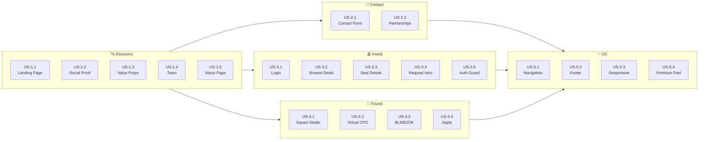

# User Stories — GoodMatter

---

## Personas

| Persona | Description |
|---|---|
| **Arjun (Angel Investor)** | Active angel investor deploying ₹25L–1Cr per deal. Wants curated, high-quality deal flow without noise. Values trusted introductions. |
| **Priya (VC Associate)** | Works at a micro-VC fund. Needs to source early-stage deals efficiently. Wants structured deal memos she can share with partners. |
| **Rahul (First-Time Founder)** | Building a SaaS startup, pre-revenue. Needs help with pitch deck, financial model, and warm investor introductions. |
| **Sneha (Growth-Stage Founder)** | Running a startup at ₹2Cr ARR. Looking for Series A investors and needs a virtual CFO for financial rigor. |
| **Vikram (Ecosystem Partner)** | Runs an accelerator. Wants to collaborate with GoodMatter on events and co-curated deal flow. |

---

## Epic 1: Public Website Discovery

### US-1.1 — Landing Page First Impression
> **As** a visitor,  
> **I want** to understand what GoodMatter does within 5 seconds of landing on the homepage,  
> **So that** I can decide whether to explore further as an investor or founder.

**Acceptance Criteria:**
- [ ] Hero section displays heading, subheading, and description above the fold
- [ ] Two clear CTAs visible: "Join as an Investor" and "Submit Your Startup"
- [ ] Page loads in < 2 seconds on 4G connection

---

### US-1.2 — Social Proof
> **As** a visitor,  
> **I want** to see logos of known investors and partners,  
> **So that** I feel confident that GoodMatter is credible and well-connected.

**Acceptance Criteria:**
- [ ] Scrolling logo belt displays at least 8 partner/investor logos
- [ ] Animation is smooth and continuous (no jank)
- [ ] Logos are recognizable and well-sized

---

### US-1.3 — Understand Value Proposition
> **As** a visitor,  
> **I want** to see clearly articulated benefits for investors and founders,  
> **So that** I understand the unique value of GoodMatter.

**Acceptance Criteria:**
- [ ] Four value proposition cards are displayed with icons, headings, and descriptions
- [ ] Content covers: Curated Dealflow, Trusted Network, Founder-Investor Alignment, High-Signal Opportunities

---

### US-1.4 — Meet the Team
> **As** a visitor,  
> **I want** to see who runs GoodMatter,  
> **So that** I can assess the team's credibility and experience.

**Acceptance Criteria:**
- [ ] Team section shows headshots with names and roles
- [ ] Subtle hover effect reveals additional context
- [ ] Professional, consistent photo treatment

---

### US-1.5 — Learn About the Mission
> **As** a visitor,  
> **I want** to read GoodMatter's mission and philosophy on the About page,  
> **So that** I can decide if their values align with mine.

**Acceptance Criteria:**
- [ ] About page has three clear sections: Mission, What We Do, Philosophy
- [ ] Philosophy section displays three pillars: Quality over Quantity, Community over Transactions, Alignment over Hype

---

## Epic 2: Contact & Inquiries

### US-2.1 — Submit a Contact Inquiry
> **As** a visitor (investor, founder, or partner),  
> **I want** to submit a contact form with my inquiry type,  
> **So that** the GoodMatter team can respond appropriately.

**Acceptance Criteria:**
- [ ] Contact form has fields: Name, Email, Phone, Inquiry Type (dropdown), Message
- [ ] Inquiry types: Investor Inquiry, Founder Application, Impact Studio, Partnership, General Query
- [ ] Form validates required fields before submission
- [ ] Success message shown after submission
- [ ] Submission creates a row in the `contacts` table

---

### US-2.2 — Partnership Interest
> **As** Vikram (ecosystem partner),  
> **I want** to see a partnerships section on the contact page,  
> **So that** I know GoodMatter is open to collaborations.

**Acceptance Criteria:**
- [ ] Partnerships blurb visible below the contact form
- [ ] Text mentions ecosystem partnerships, events, and community initiatives

---

## Epic 3: Investor Private Access

### US-3.1 — Investor Login
> **As** Arjun (angel investor),  
> **I want** to log in with my email and password,  
> **So that** I can access the curated deal flow.

**Acceptance Criteria:**
- [ ] Login form with email and password fields on `/investors` page
- [ ] "Log In" button triggers Supabase `signInWithPassword`
- [ ] On success, redirect to `/investors/dashboard`
- [ ] On failure, display inline error message
- [ ] Session persisted via HTTP-only cookies

---

### US-3.2 — Browse Curated Deals
> **As** Arjun (angel investor),  
> **I want** to see a grid of curated startup deals,  
> **So that** I can quickly scan opportunities relevant to my interests.

**Acceptance Criteria:**
- [ ] Dashboard displays deal cards in a responsive grid
- [ ] Each card shows: Startup Name, Sector, Stage, Raise Amount, One-line Summary
- [ ] Cards are clickable — navigate to deal detail page
- [ ] Only accessible to authenticated users (redirect to login if unauthenticated)

---

### US-3.3 — View Deal Details
> **As** Priya (VC associate),  
> **I want** to view a comprehensive deal memo for a startup,  
> **So that** I can evaluate the opportunity and share it with my fund partners.

**Acceptance Criteria:**
- [ ] Deal detail page shows: Overview, Founders, Product, Traction, Fundraising Details
- [ ] Attachments section with downloadable Pitch Deck and Financial Summary
- [ ] "Request Introduction to Founder" button
- [ ] Clean, scannable layout with clear section headings

---

### US-3.4 — Request Introduction
> **As** Arjun (angel investor),  
> **I want** to request an introduction to a startup's founder,  
> **So that** I can schedule a meeting and evaluate the investment firsthand.

**Acceptance Criteria:**
- [ ] "Request Introduction to Founder" button on deal detail page
- [ ] Clicking creates an `introduction_request` linked to the deal and investor
- [ ] Confirmation message displayed after request
- [ ] Button disabled after request is submitted (prevent duplicates)

---

### US-3.5 — Protected Route Enforcement
> **As** the system,  
> **I want** to prevent unauthenticated users from accessing the dashboard,  
> **So that** deal flow remains private and exclusive.

**Acceptance Criteria:**
- [ ] Navigating to `/investors/dashboard` without auth → redirect to `/investors`
- [ ] Expired session → redirect to `/investors` with `?expired=true` param
- [ ] Direct URL access to `/investors/dashboard/[id]` without auth → redirect

---

## Epic 4: Founder Application & Impact Studio

### US-4.1 — Discover Impact Studio Services
> **As** Rahul (first-time founder),  
> **I want** to see what services GoodMatter offers to founders,  
> **So that** I can decide if I should apply and use their Impact Studio.

**Acceptance Criteria:**
- [ ] Impact Studio page shows five value propositions
- [ ] Four-step process displayed: Apply → Screening → Deal Memo → Introductions
- [ ] Services section with: Pitch Deck, Financial Modeling, Valuations, Combos

---

### US-4.2 — Understand Virtual CFO Plans
> **As** Sneha (growth-stage founder),  
> **I want** to compare Virtual CFO plans by stage and scope,  
> **So that** I can choose the right financial support for my company.

**Acceptance Criteria:**
- [ ] Virtual CFO section displays plans in a tiered format
- [ ] Each tier shows: Plan Name, Stage, and scope description
- [ ] 4 main plans: Starter, Growth, CFO Partner, Fundraising CFO
- [ ] Additional services listed: Company Registration, LLP, GST, etc.

---

### US-4.3 — Explore BLKBOOK Partnership
> **As** a founder,  
> **I want** to see what BLKBOOK x GoodMatter offers,  
> **So that** I can access exclusive events and matchmaking sessions.

**Acceptance Criteria:**
- [ ] Section displays: One-Time Events, Memberships, Private/Corporate Sessions, Matchmaking
- [ ] Clear branding distinction between GoodMatter and BLKBOOK

---

### US-4.4 — Submit Startup Application
> **As** Rahul (first-time founder),  
> **I want** to submit my startup through an application form,  
> **So that** GoodMatter can review it for their investor community.

**Acceptance Criteria:**
- [ ] "Submit Your Startup" CTA navigates to application form
- [ ] Form fields: Startup Name, Founder Name, Email, Description, Sector, Stage, Raise Amount
- [ ] Optional pitch deck upload
- [ ] Submission creates a row in `founder_applications` with status "pending"
- [ ] Confirmation message after submission

---

## Epic 5: Navigation & Global UX

### US-5.1 — Consistent Navigation
> **As** a visitor,  
> **I want** a clear, consistent navigation across all pages,  
> **So that** I can easily find what I'm looking for.

**Acceptance Criteria:**
- [ ] Header with: Logo, Home, Private Access for Investors, Impact Studio for Founders, About, Contact Us
- [ ] Two CTA buttons in header: Investor Login, Apply as Founder
- [ ] Mobile hamburger menu with slide-out panel
- [ ] Active page highlighted in navigation

---

### US-5.2 — Footer on All Pages
> **As** a visitor,  
> **I want** quick links, social links, and contact information in the footer,  
> **So that** I can navigate or reach out from any page.

**Acceptance Criteria:**
- [ ] Footer on every page with: Quick Links, Social Links (LinkedIn, Twitter), Email, Copyright
- [ ] Email link: goodmatter05@gmail.com
- [ ] Consistent styling across all pages

---

### US-5.3 — Responsive Experience
> **As** a mobile user,  
> **I want** the website to be fully usable on my phone,  
> **So that** I can browse deals and submit forms on the go.

**Acceptance Criteria:**
- [ ] All pages render correctly on 375px+ screens
- [ ] Touch-friendly button sizes (min 44px tap target)
- [ ] Navigation collapses to hamburger on mobile
- [ ] Card grids stack to single column on small screens
- [ ] Text remains readable without horizontal scrolling

---

### US-5.4 — Premium Visual Experience
> **As** a visitor,  
> **I want** the website to feel premium, clean, and trustworthy,  
> **So that** I associate GoodMatter with quality and professionalism.

**Acceptance Criteria:**
- [ ] Jony Ive-inspired design: generous whitespace, restrained palette, purposeful typography
- [ ] Smooth micro-animations (fade-in, hover lift, glass header)
- [ ] No visual clutter — every element serves a function
- [ ] Consistent design language across all pages

---

## Story Map

---

## Priority Matrix

| Priority | Stories | Rationale |
|---|---|---|
| **P0 — Must Have** | US-1.1, 1.3, 2.1, 3.1, 3.2, 3.3, 3.5, 4.1, 4.4, 5.1, 5.2 | Core platform functionality |
| **P1 — Should Have** | US-1.2, 1.4, 1.5, 2.2, 3.4, 4.2, 4.3, 5.3, 5.4 | Enhanced experience & completeness |
| **P2 — Nice to Have** | Deal notifications, application status tracking | Future iteration features |
